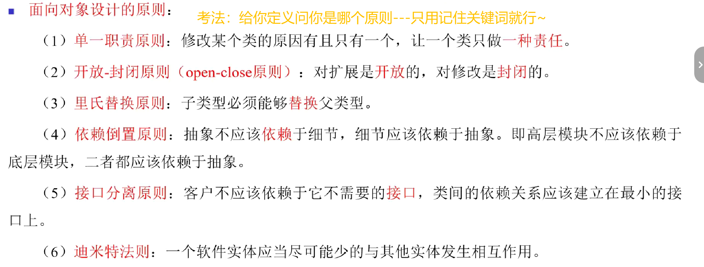
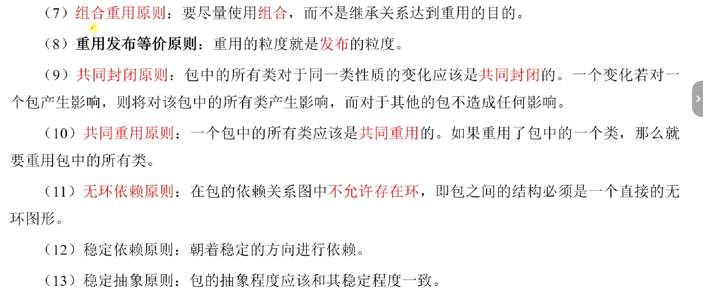
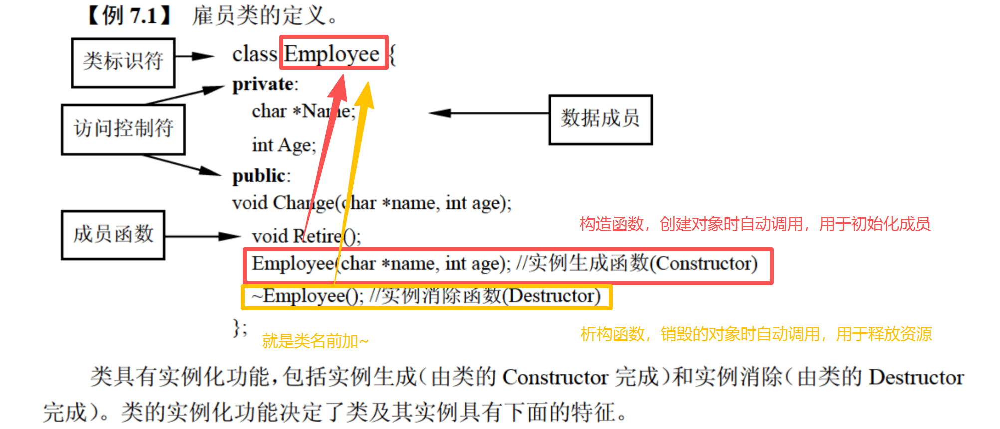
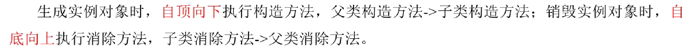
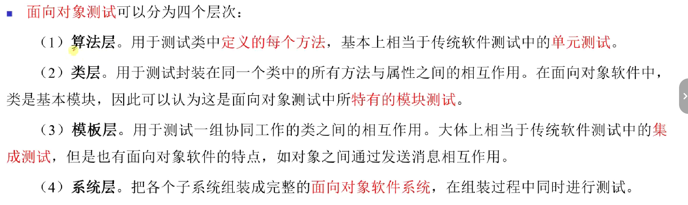

面向对象技术<br>
上午单选11分，下午2道案例分析30分（UML+设计模式）

## 目录
- [什么是面向对象（OO）](#什么是面向对象oo)
- [核心概念](#核心概念)
- [基本语法](#基本语法)
- [三大特性](#三大特性)
  - [1. 封装](#1-封装)
    - [1.1 基本概念](#11-基本概念)
    - [1.2 私有化](#12-私有化)
    - [1.3 优缺点](#13-优缺点)
  - [2. 继承](#2-继承)
    - [2.1 基本概念](#21-基本概念)
    - [2.2 基本格式](#22-基本格式)
    - [2.3 继承的种类](#23-继承的种类)
    - [2.4 重写（覆盖）](#24-重写覆盖)
    - [2.5 super关键字](#25-super关键字)
    - [2.6 优缺点](#26-优缺点)
  - [3. 多态](#3-多态)
    - [3.1 基本概念](#31-基本概念)
    - [3.2 多态分类](#32-多态分类)
    - [3.3 实现多态的三个条件](#33-实现多态的三个条件)
    - [3.4 优缺点](#34-优缺点)
- [魔法方法](#魔法方法)
  - [1. 魔法方法](#1-魔法方法)
  - [2. __init__](#2-__init__)
  - [3. __str__](#3-__str__)
  - [4. __del__](#4-__del__)
- [动态绑定](#动态绑定)
- [抽象类](#抽象类)
- [类属性和对象属性](#类属性和对象属性)
- [类方法和静态方法](#类方法和静态方法)
- [面向对象分析（OOA）](#面向对象分析ooa)
- [面向对象设计（OOD）](#面向对象设计ood)
- [面向对象程序设计（OOP）](#面向对象程序设计oop)
- [面向对象测试](#面向对象测试)
<br>

## 什么是面向对象（OO）
（1）面向对象和面向过程的区别？

`面向过程`：将问题分解为具体**步骤**，按序执行，需亲力亲为每个环节

`面向对象`：不关注具体实现细节，只关注**对象**的操作和交互（对象仍需面向过程来实现功能）

>eg. 把大象装进冰箱
>
>面向过程：关心我该怎么做？如何一步步实现这个功能？<br>
>我打开冰箱->我把大象装进冰箱->我关上冰箱
>
>面向对象：关心我该让谁去做？调用对象的操作来实现功能<br>
>（对象：冰箱、大象）<br>
>冰箱打开冰箱门->大象钻进冰箱->冰箱关上冰箱门

思维：一切皆对象，所有对象又被赋予了`属性`和`方法`来模拟现实世界，属性即名词，方法即动词

（2）**面向对象的底层依赖面向过程**

（如我们给洗衣机洗衣服，我们面向对象，洗衣机内部仍需按步骤完成洗涤的过程）

（3）什么是面向对象？

`概述-特点-举例-总结`

概述：面向对象是一种 *编程思维*，强调 *以对象为基础* 完成各种操作，它是 *基于面向过程* 的。

三大特点：更符合人们的思考习惯、把复杂问题简单化、把程序员从执行者变成指挥者

举例：选择环境中的实际对象举例<br>
eg. 所有的花卉统称为类，每种具体的花称为一个对象

总结：一切皆对象
<br><br>

## 核心概念
`对象`：包括数据(属性/状态)和作用于数据的操作(方法/行为)

`属性`：名词，描述特征，相当于变量<br>
>`状态`：对象的属性+每个属性的当前值

`方法`：动词，描述操作，相当于函数

>可以说，对象把属性和行为封装为一个整体<br>
>`对象 = 对象名 + 属性 + 方法（行为在代码层的具体实现）`

`类`：把一组对象的共同特征加以抽象，存储在类中

>类分为：实体类、接口类（边界类）、控制类<br>
>实体类对象：具体实体<br>
>接口类对象：接口（用户和系统交互的接口），比如显示屏、窗口等<br>
控制类对象：控制活动流，充当协调者
>类比一下，实体类相当于菜、顾客，接口类相当于服务员、菜单，控制类相当于调度员

类和对象的关系:<br>
类：创建对象的模板，是*对象的抽象*，看不见摸不着<br>
对象：类的实例化，是*类的具体实现*，看得见摸得着

通信：对象间通过消息传递（对象引用）进行通信<br>
`消息`：对通信的一种规格说明，一般由三部分组成---接收消息的对象+消息名+实际变元<br>
举个例子：<br>
假设我们有一个Car类，定义如下：<br>
``` python
class Car:
    def __init__(self, brand, color, model):
        self.brand = brand
        self.color = color
        self.model = model

    def start(self):
        print(f"The {self.brand} {self.model} is starting.")

    def accelerate(self, speed):
        print(f"The {self.brand} {self.model} is accelerating to {speed} km/h.")

    def brake(self):
        print(f"The {self.brand} {self.model} is braking.")
```
现在我们创建一个具体的Car对象：<br>
``` python
my_car = Car("Toyota", "Red", "Corolla")
```
接下来，我们发送一个消息给my_car对象，调用它的accelerate方法，并传递一个实际变元100<br>
``` python
my_car.accelerate(100)
```
在这个例子中，消息的三部分分别是：<br>
接收消息的对象（Receiver）：my_car。消息的接收者，即Car类的一个实例<br>
消息名（Message Name）：accelerate。消息的名称，对应于Car类中的accelerate**方法**<br>
实际变元（Actual Arguments）：100。**传递给**accelerate**方法的具体参数**，表示汽车加速到100公里/小时<br>

`接口`：对操作规范的说明<br>
举个例子：<br>
假设我们有一个Animal接口，它定义了一组操作的规范，即所有动物都必须有eat和make_sound这两个方法<br>
那么，不同的动物类（如Dog和Cat）实现这个接口时，就必须提供eat和make_sound方法的具体实现<br>
尽管Dog和Cat都实现了Animal接口，但它们的行为（方法的实现）是不同的。这也体现了接口支持多态性
<br><br>

## 基本语法

```python
# 定义类
class Car():
    def run(self): # 定义类的方法时必须包含self（谁调用，self就代表谁）
        print("run")
    def work(self):
        self.run() # 类内部，通过self.的方式调用其他成员
        print("work")

# 测试代码写main里，只在运行该文件时执行，其他文件导入模块时不执行
if __name__ == '__main__': # 输入main回车就会自动补全
    # 创建对象
    car = Car()
    # 调用方法
    car.work()
    # 类外添加的属性只属于当前对象，其他同类对象不具备
    car.color = "red"
    print(f"汽车颜色:{car.color}")
```

注意：

1.定义类有三种格式：不带括号、带括号、括号里是object，三者功能完全相同，其中object是所有类的父类

2.只能在类外给对象添加属性，一个个添加很麻烦，因此后续会学习通过`__init__`魔法方法在创建对象时自动初始化属性

2.快捷键技巧：`Ctrl+D`复制当前行，`Alt+Shift+方向键`移动当前行，按住`Ctrl`再点击变量会跳转到定义变量的位置（用于debug）
<br><br>

## 三大特性
封装、继承、多态
### 1. 封装
#### 1.1 基本概念
`封装`：将属性和方法封装成类，*隐藏实现细节，仅提供公共接口*

#### 1.2 私有化
`私有化`：隐藏父类的某些属性或方法，让子类无法访问

私有化：`__属性名`或 `__方法名()` （双下划线）
>cpp和Java用private关键字（只有当前类中定义的方法可以访问）

>访问限定符（修饰符）：<br>
>Private 私有: 仅在同一个类内可访问<br>
>Protected 受保护: 同一包内其他类以及包外子类可访问<br>
Public 公有：其他包也可访问


获取私有化属性：定义`get_××`方法

修改私有化属性：定义`set_××`方法

获取私有化方法：定义一个公有方法来访问私有方法（相当于给了一个公有接口）

例子：

```python
# 私有化
class Prentice(object):
    def __init__(self):
        self.kongfu = '独创煎饼果子技术'
        self.__money = 500 #私有化money
    def make_cake(self):
        print(f'采用{self.kongfu}制作煎饼果子')
    # 提供公共接口访问money
    def get_money(self):
        return self.__money
    # 提供公共接口修改money
    def set_money(self, money):
        self.__money = money
class TuSun(Prentice):
    pass

if __name__ == '__main__':
    ts = TuSun()
    print(ts.get_money())
    ts.set_money(600)
    print(ts.get_money())
```

#### 1.3 优缺点
优点：<br>
1.简化编程（其他开发人员不需要知道软件组件内部如何工作）<br>
2.提高安全性（类）<br>
3.提高复用性（函数）

缺点：<br>
增加代码量
<br>

### 2. 继承
#### 2.1 基本概念
`继承`：允许一个类（子类）获取另一个类（父类）的属性和方法

`父类`又称基类/超类，`子类`又称派生类/扩展类
子类是父类的**特例**

父类和子类之间共享数据和方法<br>
子类拥有父类所有的**非私有化**的属性和方法

继承（子类角度）：获取父类成员特性(公共特性）<br>
`派生`（父类角度）：产生新的子类

#### 2.2 基本格式
```python
class 父类(object):
    定义属性和方法
```

```python
class 子类(父类1，父类2...):
    pass
```
所有类默认继承自object类（顶级基类）

#### 2.3 继承的种类
`单（重）继承`：单一父类

`多（重）继承`：多个父类

当多个父类有重名属性或方法时，*优先使用第一个父类*（遵循MRO规则）

MRO规则：Method Resolution Order（方法解析顺序），先找第一个父类，如果没有再找第二个父类，以此类推

（子类自己-->第一个父类-->第二个父类-->...-->object）

MRO调用方式：`类名.__mro__`或`类名.mro()`，查看实际顺序

`多层继承`：继承链（继承关系的传递性），A-->B-->C-->D

实际开发中建议继承深度不超过3层，避免过度耦合

#### 2.4 重写（覆盖）
子类在继承父类的同时想对父类进行改造，有自己的独有需求时，可以*重新定义父类的属性或方法*，即`重写`或`方法重写`，实际更常用的是方法重写

根据MRO规则，重写后*优先使用子类自己的属性或方法*

重写的优点：提高扩展性

>区分于`重载`（**一名多用**）重载分为两种：<br>
>函数重载：同一个类中，函数名相同，参数不同（类型/个数/顺序）<br>
>运算符重载：给定义类加减乘除等运算符赋予新的含义

子类可以覆盖父类中抽象/非抽象的方法<br>
抽象方法：父类pass掉，只说明要实现的功能；子类负责实现<br>
非抽象方法：父类已经给出了实现，子类重写

#### 2.5 super关键字
重写后子类如何访问父类的成员？

1.`父类名.父类方法名(self)`  用于多继承，精准初始化某个父类属性

2.`super().父类方法名()` 单继承

这里需要用到super关键字

super关键字：

（1）概述：代表 本类当前对象 父类的引用

（2）简单理解：**self代表自己，super代表父类**

（3）适用情况：super()只能初始化第一个父类的成员，所以super不适合多继承，更适合单继承

（4）重点：随着代码不断往下执行，**后面的初始化覆盖前面的，self也会变成不断被覆盖**

例子：

（1）单继承

```python
# 摊煎饼案例（单继承 + 重写）
# 师傅类
class Master(object):
    # 构造方法，给类的对象初始化属性
    def __init__(self): 
        self.kongfu = '古法摊煎饼果子技术'
    # make_cake方法
    def make_cake(self): 
        print(f'采用{self.kongfu}制作煎饼果子')
# 徒弟类
class Prentice(Master):
    # 重写属性和方法
    def __init__(self):
        self.kongfu = '独创煎饼果子技术'
    # 调用徒弟自己的方法，可以不写，直接继承
    def make_cake(self):
        print(f'采用{self.kongfu}制作煎饼果子')
    # 调用老师傅的方法
    def make_master_cake(self):
        super().__init__() # 一定要先初始化父类的属性！！！确保读到正确的属性值(kongfu)
        super().make_cake()

if __name__ == '__main__':
    p = Prentice() # kongfu是独创
    p.make_cake() # kongfu是独创
    p.make_master_cake() # 调用super().__init__(),kongfu变为古法
```

（2）多继承

```python
# 摊煎饼案例（多继承 + 重写）
# 师傅类
class Master(object):
    def __init__(self):
        self.kongfu = '古法摊煎饼果子技术'
    def make_cake(self):
        print(f'采用{self.kongfu}制作煎饼果子')
# 学校类
class School(object):
    def __init__(self):
        self.kongfu = '黑马AI摊煎饼果子技术'
    def make_cake(self):
        print(f'采用{self.kongfu}制作煎饼果子')
# 徒弟类
class Prentice(School, Master):
    # 重写属性和方法
    def __init__(self):
        self.kongfu = '独创煎饼果子技术'
    # 调用徒弟自己的方法，可以不写，直接继承
    def make_cake(self):
        print(f'采用{self.kongfu}制作煎饼果子')
    # 调用老师傅的方法
    def make_master_cake(self):
        Master.__init__(self) # 一定要先初始化父类的属性！！！
        Master.make_cake(self)
    # 调用学校的方法
    def make_school_cake(self):
        School.__init__(self)
        School.make_cake(self)

if __name__ == '__main__':
    p = Prentice()
    p.make_cake()
    p.make_master_cake()
    p.make_school_cake()
```
#### 2.6 优缺点
优点：<br>
1.提高复用性（子类继承父类功能）<br>
2.提高可维护性（修改父类即修改所有子类）

缺点：<br>
强耦合（父类缺陷子类不可避免，除非是私有）
<br>

### 3. 多态
#### 3.1 基本概念
`多态`：**同一事物**在不同环境中表现不同的形态（如水的三态、人的多重身份）

在代码中体现为：<br>
不同对象收到同一消息，会产生不同的结果<br>

#### 3.2 多态分类


记关键词！<br>
参数多态：采用参数化模板，传递不同类型的对象，**参数**不一样，执行的代码一样（如cpp中的函数模板和类模板）<br>
包含多态：最常见的就是**子类型化**，即一个类型是另一个类型的子类型，本质上是覆盖（如cpp中的虚函数）<br>
过载多态：**同名**（操作符、函数名）在不同的上下文中有不同的含义，本质上就是**重载**（如cpp中的*函数重载*，多个函数，函数名相同，传入参数的个数/类型/顺序不同）<br>
强制多态：将一个对象的**类型转化**为另一个对象的类型（类似cpp中的隐式类型转换，如对不同类型的数据进行混合运算时编译程序会强制多态）<br>

Q1：参数多态和过载多态的区别？

绑定时间：<br>
参数多态：动态绑定，运行时确定<br>
过载多态：静态绑定，编译时确定

实现机制：<br>
参数多态：通过泛型（类型参数）来实现，提供一个统一的接口（**只有一个函数**，他的参数是类型参数，具体实现时传入不同的参数实现多态）<br>
过载多态：通过**定义多个同名但参数列表不同的方法**来实现

分别举例：<br>
参数多态：
``` python
from typing import TypeVar, Generic
# 定义一个类型变量T。T可以代表任何类型，具体类型在类或方法被使用时确定，可以是int、float、str等
# 专业说法也可以叫类属，可以理解成具体类型的占位符
T = TypeVar('T') 
# 定义一个泛型类Calculator。Generic[T]表示Calculator类是一个泛型类，它有一个类型参数T。可以创建不同类型的Calculator实例，例如Calculator[int]、Calculator[float]等
class Calculator(Generic[T]):
    def add(self, a: T, b: T) -> T:
        return a + b
# 调用
calc_int = Calculator[int]() # 调用时确定类型变量的具体类型
result = calc_int.add(1, 2)
print(result)  # 输出: 3
```

过载多态：
``` python
>class Calculator:
    def add(self, a: int, b: int) -> int:
        return a + b

    def add(self, a: float, b: float) -> float:
        return a + b

    def add(self, a: str, b: str) -> str:
        return a + b
```

Q2：包含多态的子类型是什么意思，和子类的不同在哪里？？？看不懂kimi在说啥哈哈

#### 3.3 实现多态的三个条件
（1）有继承

>多态的实现受到**继承**的支持
>
>利用类的继承的层次关系，把具有通用功能的消息存放在高层次，而不同的实现这一功能的行为放在较低层次，在这些低层次上生成的对象能够给通用消息以不同的响应

（2）有重写

（3）要有父类引用指向子类对象（例如Animal = Dog() ）

例子：

```python
# 多态案例（包含多态）
# 有继承
class Animal(object):
    def speak(self):
        pass
class Dog(Animal):
    def speak(self):
        print('汪汪汪')
class Cat(Animal):
    def speak(self):
        print('喵喵喵')
# 有多态
def make_noise(an : Animal): # 意思是an必须是Animal的对象，或者其子类对象
    an.speak()

if __name__ == '__main__':
    # 创建类对象
    d = Dog()
    c = Cat()
    make_noise(d)
    make_noise(c)
```
理论上，make_noise只能传入Animal的对象，但是python中即使传入别的也可以执行，不会报错，所以python的多态也称为“伪多态”

原因：Python类型注解不会强制检查参数类型，而Java就是强制的

#### 3.4 优缺点
优点：<br>
高内聚（提高类独立处理问题的能力）、低耦合（减少类间依赖）<br>
提高扩展性（一个函数多种效果）
<br><br>

## 魔法方法
### 1. 魔法方法
（1）命名格式：`__方法名__`（双下划线）<br>
（2）**自动调用**：满足特定条件时会自动触发，无需手动执行<br>
（3）核心作用：为Python类添加特殊功能<br>
（4）*常用魔法方法：`__init__`，`__str__` ，`__del__`*
<br>

### 2.__ init __
*用于初始化对象的属性值，创建对象时自动调用*

（1）无参数：所有对象默认属性相同，扩展性差
```python
class Car():
    def __init__(self):  # 类内用init魔法方法初始化属性
        self.color = 'red'
        self.number = 4

if __name__ == '__main__':
    car1 = Car()
    print(f"汽车颜色:{car1.color},汽车轮胎数:{car1.number}")
    car2 = Car()
    car2.color = 'black'# 修改属性值
    print(f"汽车颜色:{car2.color},汽车轮胎数:{car2.number}")
```

（2）有参数：属性值由外部传入，提高扩展性
```python
# 有参数
class Car():
    def __init__(self, color, number):  # 参数名就和属性名相同，便于理解
        self.color = color
        self.number = number

if __name__ == '__main__':
    car = Car('red', 4) # 在类外创建对象时传入参数
    print(f"汽车颜色:{car.color},汽车轮胎数:{car.number}")
```
内存图演示：


<br>

### 3. __ str __
*用于快速打印对象的属性，输出语句打印对象时自动调用*
（print 默认打印对象的内存地址）

```python
class Car():
    def __init__(self, color, number):  # 参数名就和属性名相同，便于理解
        self.color = color
        self.number = number
    def __str__(self):
        return f"汽车颜色:{self.color},汽车轮胎数:{self.number}"

if __name__ == '__main__':
    car = Car('red', 4) # 在类外创建对象时传入参数
    print(car) # 将car作为self参数传给__str__()方法
```

### 4. __ del __
*用于销毁对象，删除对象或者main函数执行完毕时自动调用*
（释放对象占用的系统资源，节省内存空间）

```python
class Car():
    def __init__(self, color, number):  # 参数名就和属性名相同，便于理解
        self.color = color
        self.number = number
    def __str__(self):
        return f"汽车颜色:{self.color},汽车轮胎数:{self.number}"
    def __del__(self):
        print(f"{self}对象被释放了")

if __name__ == '__main__':
    car = Car('red', 4) # 在类外创建对象时传入参数
    print(car) # 将car作为self参数传给__str__()方法
```
<br>

## 动态绑定
绑定：把`过程调用`和`响应调用`所需要执行的代码加以结合

`静态绑定`：在一般的程序设计语言中，绑定是在**编译**时进行的（如重载：同一个类中，允许定义多个同名方法，但这些方法的参数列表，如参数的数量/类型/顺序必须不同。可以这么记忆：*编译时这几个同名函数就写好了，编译时就绑定了*）<br>
`动态绑定`：过程调用和响应调用需执行的代码直到**运行**时才能进行（如重写：在子类中重新定义父类中的方法）
<br><br>

## 抽象类
`抽象类`：有抽象方法的类

在Python中抽象类与接口完全等价（与Java不同）

`抽象方法`：方法体是空实现（pass）的方法

例如：

```python
class Animal(object):
    def speak(self):
        pass
```

注意：抽象类不能直接实例化，只能作为父类被继承

总结：**父类确定有哪些方法，子类完成方法的实现；父类制定标准，子类负责实现；父类考虑要做什么，子类考虑怎么做**
<br><br>

## 类属性和对象属性
1.`类属性`：类的所有对象共享，A对象修改了类属性，其他对象再使用的就是修改后的

定义类属性：<br>
定义在类中，函数外的变量就是类属性

获取类属性：<br>
推荐使用：类名.类属性名<br>
可用但不推荐：对象名.类属性名

2.`对象属性`：每个对象特有的，对象之间互不影响

定义对象属性：<br>
类内：self.属性名=属性值<br>
类外：对象名.属性名=属性值<br>

获取对象属性：<br>
类内：self.属性名<br>
类外：对象名.属性名
<br><br>

## 类方法和静态方法
1.`实例方法`：<br>
*第一个参数必须是self，实例本身*<br>
调用方法：推荐 对象名.

例如：

```python
class Student(object):
    # 类属性
    teacher_name = '王老师'
    # 实例方法
    def method00(self,stu_name):
        print(f'{self.teacher_name}的学生是{stu_name}') # 通过self访问

if __name__ == '__main__':
    stu = Student()
    stu.method00('张三') # 推荐对象名
    Student.method00(stu,'张三') # 也可以
```

2.`类方法`：<br>
*第一个参数必须是cls(class)，类本身*<br>
通过@classmethod装饰器修饰<br>
调用方法：推荐 类名.

例如：

```python
class Student(object):
    # 类属性
    teacher_name = '王老师'
    # 类方法
    @classmethod
    def method01(cls, stu_name):
        print(f'{cls.teacher_name}的学生是{stu_name}') # 通过cls访问

if __name__ == '__main__':
    stu = Student()
    Student.method01('张三') # 推荐类名
    stu.method01('张三') # 也可以
```

3.`静态方法`：<br>
*第一个参数无硬性要求，可不传参*<br>
通过@staticmethod装饰器修饰<br>
调用方法：推荐 类名.

例如：

```python
class Student(object):
    # 类属性
    teacher_name = '王老师'
    # 静态方法
    @staticmethod
    def method02(stu_name):
        print(f'{Student.teacher_name}的学生是{stu_name}') # 通过类名访问

if __name__ == '__main__':
    stu = Student()
    Student.method02('张三') # 推荐类名
    stu.method02('张三') # 也可以
```

感觉1和3好理解一点
<br><br>

## 面向对象分析（OOA）
五个核心活动：<br>
对象认定：确定问题域，识别系统中的具体对象（找名词，且要是具体实体）<br>
对象组织：建立对象间的结构关系（抽象出类）<br>
对象交互：分析对象间的消息传递机制<br>
确定操作：明确对象的方法和属性<br>
内部定义：定义对象的内部，包括其内部数据信息、信息存储方法、继承关系以及可能生成的实例数等属性
<br><br>

## 面向对象设计（OOD）
将分析模型转化为设计模型

主要活动（区分于面向对象分析）：识别类及对象、定义属性、定义服务、识别关系、识别包

**对象设计的原则**（常考）:





>里氏替换原则：在任何父类可以出现的地方，都可以用子类的实例来赋值给父类型的引用（is-a）关系

>（1）~（5）是面向对象设计的五大原则
<br><br>

## 面向对象程序设计（OOP）
面向对象程序设计的实质是选用一种面向对象程序设计语言（OOPL）

它的关键在于加入了类和继承性，进一步提高了抽象程度

设计和实现一个面向对象程序时，首先接触到的不是对象，而是类和类层次结构



>注：用构造函数创建对象时，会自动调用析构函数销毁；但如果你是new对象，那就需要delete手动销毁<br><br>

子类与父类之间的继承关系构成了系统的类层次结构，可以用树(对应于单继承)或格(对应于多继承)来描述


<br><br>

## 面向对象测试

