## 目录
  - [事物](#事物)
    - [结构事物](#结构事物)
    - [行为事物](#行为事物)
    - [分组事物](#分组事物)
    - [注释事物](#注释事物)
  - [关系](#关系)
    - [依赖](#依赖)
    - [关联](#关联)
    - [泛化](#泛化)
    - [实现](#实现)
  - [图](#图)
    - [类图](#类图)
    - [用例图](#用例图)
    - [序列图](#序列图)
    - [状态图](#状态图)
    - [活动图](#活动图)
    - [对象图](#对象图)
    - [通信图](#通信图)
    - [交互概览图](#交互概览图)
    - [计时图](#计时图)
    - [构件图](#构件图)
    - [组合结构图](#组合结构图)
    - [部署图](#部署图)
    - [包图](#包图)

UML：统一**建模**语言（面向对象软件的标准化建模语言） 
建模：通过**画图**来表示我们的系统

UML由3个要素构成：UML的基本构造块、支配这些构造块如何放置在一起的规则和运用、整个语言的一些公共机制 

下面就构造块进行讨论，包含3种：**事物、关系、图** 

## 事物(考的少）
4种：结构事物、行为事物、分组事物、注释事物

### 结构事物
属于模型中的静态部分（**名词**），包括以下几种：

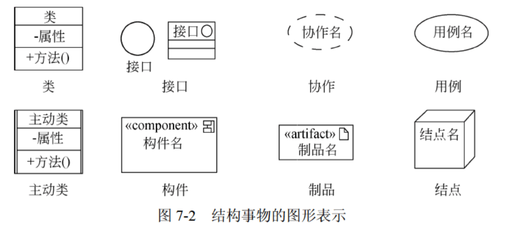

>其中：
>`协作`包括角色、链、交互图（即描述谁、和谁、做什么、怎么做），用来实现用例 
>而`用例`只关心‘做什么’，不关心‘怎么做’ 
>`构建`是系统中的一个**模块化部件**，它*封装了实现*（代码、脚本、数据库表……）；提供对外*接口*；可独立部署（deployable）且可替换（substitutable），类似于一块积木

### 行为事物
动态部分，描述**行为**

分为交互、状态机、活动 
>交互：对象间消息的交换，涉及消息、动作序列（由一个消息所引起的行为）和链（对象间的连接） 
>状态机：状态间的转换，涉及状态、转换(从一个状态到另一个状态的流)、事件(触发转换的事物)和活动(对一个转换的响应) 
>活动：步骤序列（不关注对象，只关注步骤，一个步骤就是一个动作）

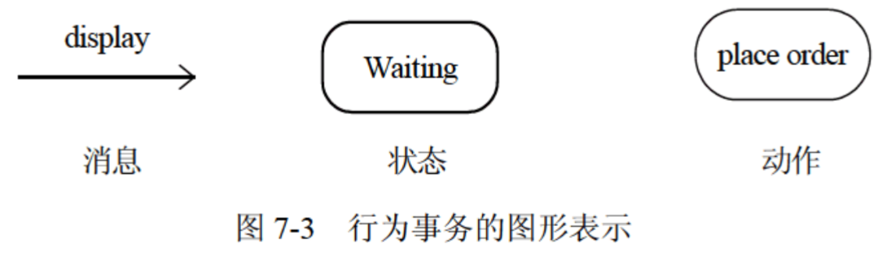

### 分组事物
组织部分，最主要的：包（把其他事物组织起来放在一起）

### 注释事物
解释部分，例如注解
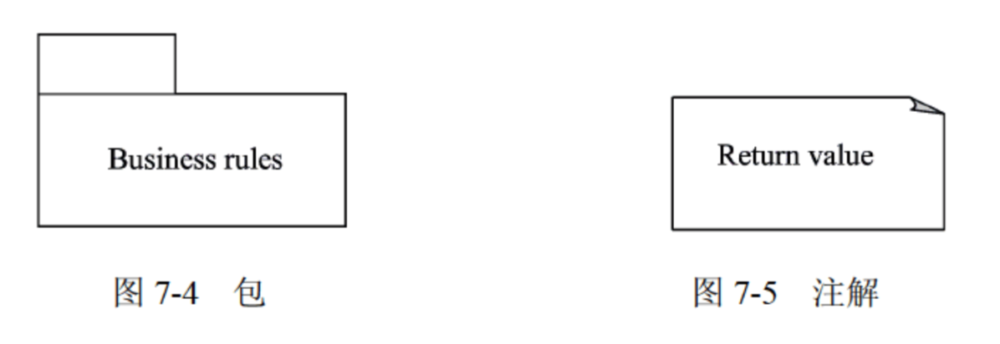

## 关系（比较重要）
4种：依赖、关联、泛化、实现 
掌握图形化：

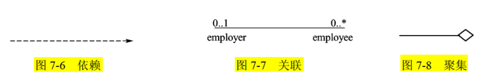
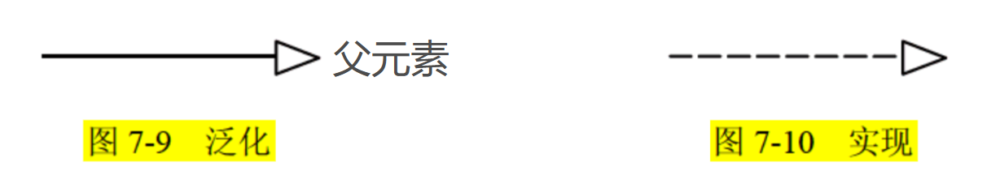

### 依赖
事物间的语义关系，`独立事物`变化会影响`依赖事物`的语义

### 关联
结构关系，描述对象间的关联，用链表示 
关联上可标注重复度（也叫多重度）和角色
>多重度类型： 
>一对一(1:1) 
>一对多(1:n或1:*) 
>多对多(m:n或*:*)

聚集和组合是特殊的关联 
聚类的部分可以离开整体独立存在（空心菱形），而组合不行（实心菱形）

### 泛化
特殊/一般关系，`特殊元素（子元素）`的对象可代替`一般元素（父元素）`的对象 
类似**继承**：父类是子类的泛化，子类是父类的具体化

### 实现
类元间的语义关系 
例如：接口和实现接口的类/构建，用例和实现他们的协作

## 图
共13种：

结构图(静态视图)： 
**类图**、对象图、构件图、部署图、组合结构图、包图

行为图(动态视图)： 
交互图：序列图(顺序图）、通信图、交互概览图、计时图 
**用例图**、状态图、活动图

### 类图⭐⭐
描述类、类的特性、类间关系 
包括类、接口、协作、关系（关联、依赖、泛化）

举个例子：

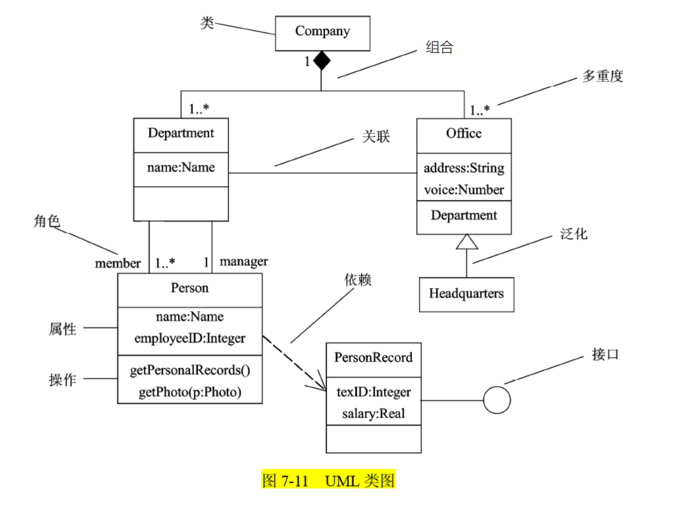

对这个类图我们大概可以这样解析：

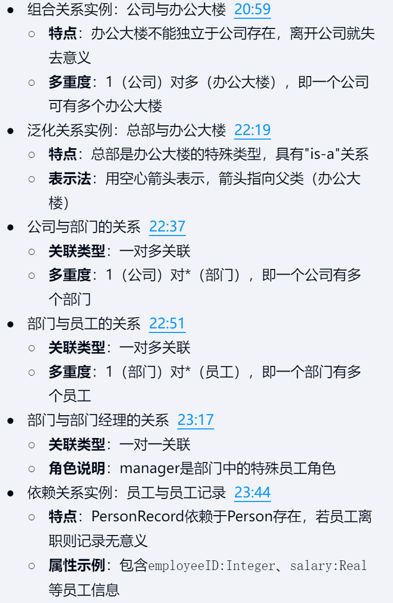

### 用例图⭐⭐
描述一组用例、参与者以及他们之间的关系 

这个关系具体有：用例之间的`包含关系(<<include>>)`，`扩展关系(<<extend>>)`，参与者和用例间的`关联关系`，用例间以及参与者间的`泛化关系` 
>包含：从两个及以上的用例中提取公共行为 
>扩展：一个用例混合了多种不同场景，不同情况可能有不同分支，则将它分为一个基本用例和一个或多个扩展用例 

举个例子：

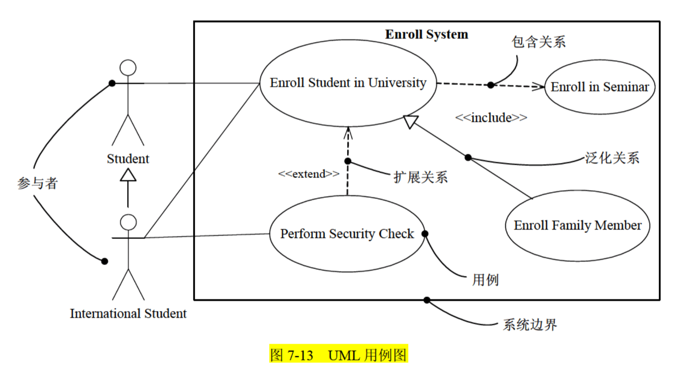

### 序列图⭐
也叫顺序图，属于交互图 
描述对象间的交互（消息的发送与接收），强调按时间顺序 
消息沿垂直方向按时间顺序从上到下放置 

>注意： 
>序列图有`对象生命线`。对象生命线是一条垂直的虚线，表示对象在一段时间内存在（大X表示生命的结束） 
>序列图有控制焦点。控制焦点是一个瘦高的矩形，表示对象执行一个动作所经历的时间段。

举个例子：

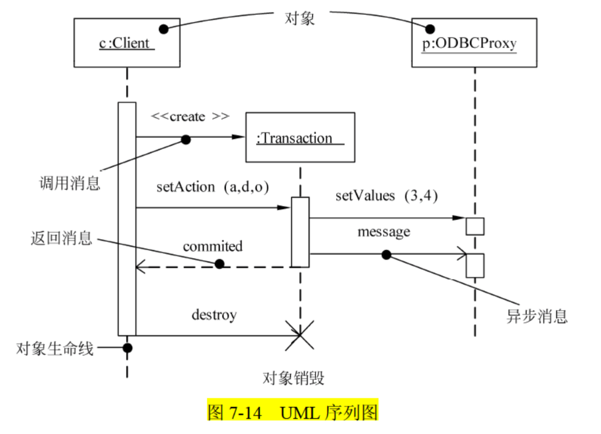

### 状态图⭐
描述对象状态及其转换，强调对象行为的事件顺序 
包括状态（简单状态、组合状态），转换（什么事件引起的状态转换，以及活动）

举个例子：

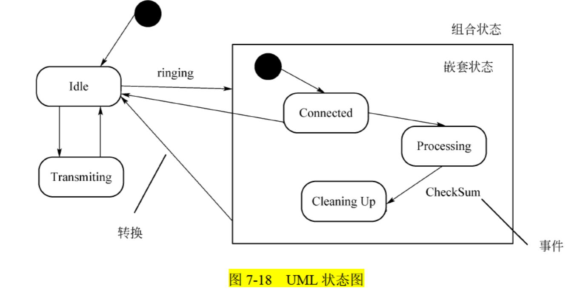

### 活动图⭐
活动图是一种特殊的状态图，描述从一个活动到另一个活动的流程

>整个流程图是一个活动（订单接收活动），整个活动又被拆分成了一个个动作
>活动图可以表示分支、合并、分岔和回合
>并发分岔是两分岔同时进行

举个例子：

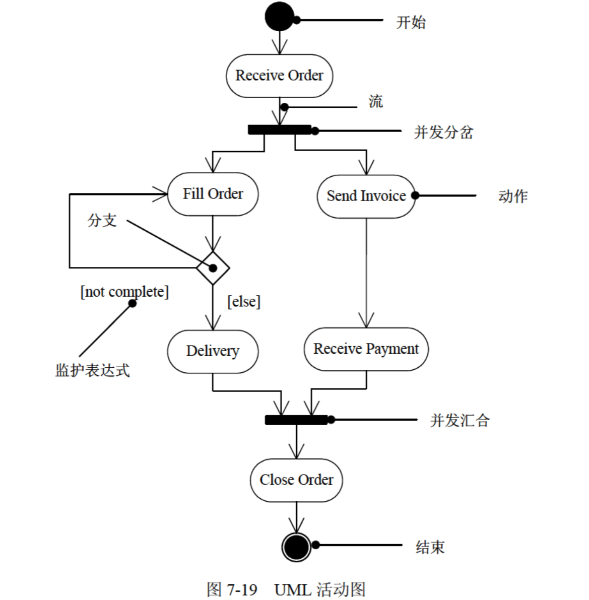

### 对象图
描述某一时刻一组对象和它们之间的关系

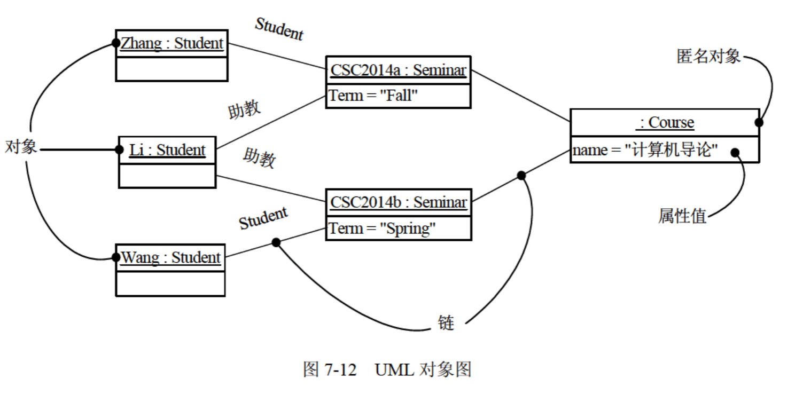

### 通信图
属于交互图 
通信图强调交互对象的结构组织，和序列图是同构的，它们之间可以相互转换

>注意：（了解即可） 
>通信图有路径，在链的末端附上一个路径构造型(如构造型《local》，表示指定对象对发送者而言是局部的 
>通常只需要显式地表示以下几种链的路径：local(局部)、parameter(参数)、global(全局)以及self(自身)，但
不必表示association(关联) 
>通信图有序号，用来表示消息的顺序 

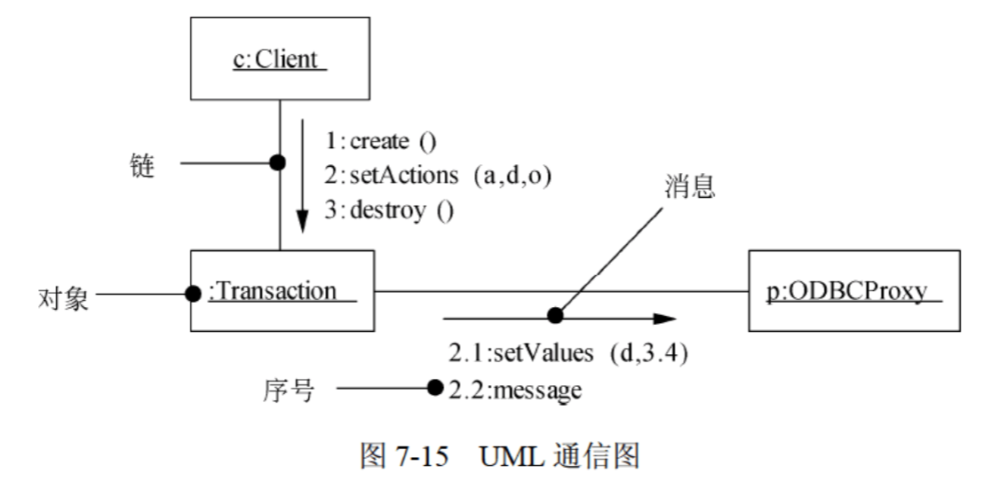

### 交互概览图
活动图的变体，描述控制流概览、详细逻辑概览，抽象掉了消息和生命线，所有活动都是交互发生

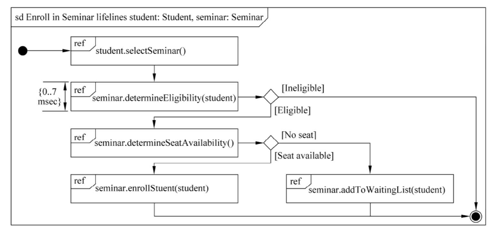

### 计时图
适合**实时和嵌入式系统**建模的交互图 
关注沿着线性时间轴、生命线内部和生命线之间的条件改变 
图像类似示波器样式

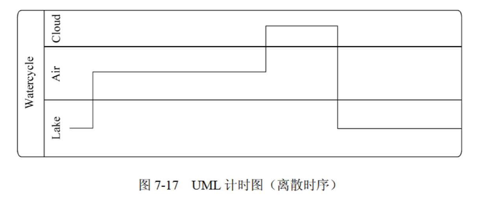

### 构件图
描述一组构件之间的组织和依赖

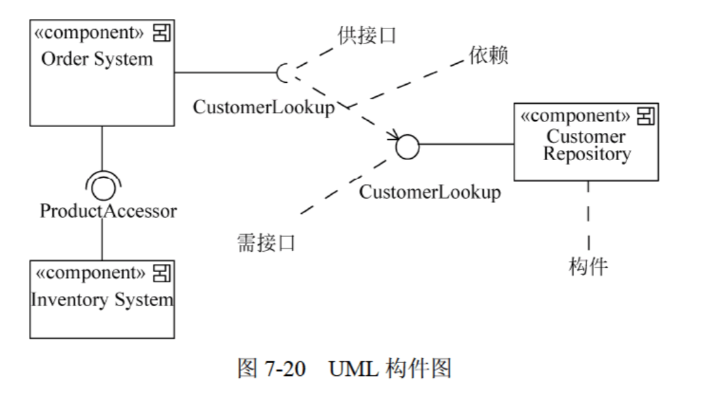

### 组合结构图
用于描述一个分类器(如类、构件或用例)的**内部结构**，分类器与系统中其他组成部分之间的交互端口，展示一组**相互协作的实例如何完成特定的任务**，描述设计、架构模式或策略

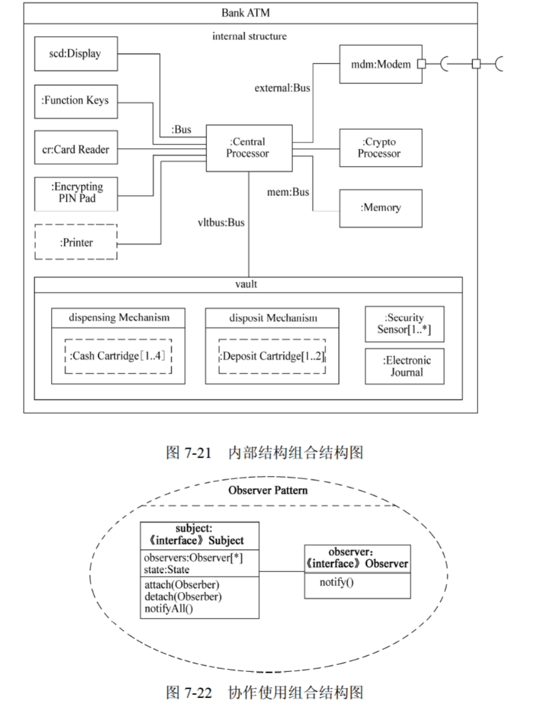

### 部署图
**物理方面**建模，展现了处理结点以及其中构件(制品)的配置

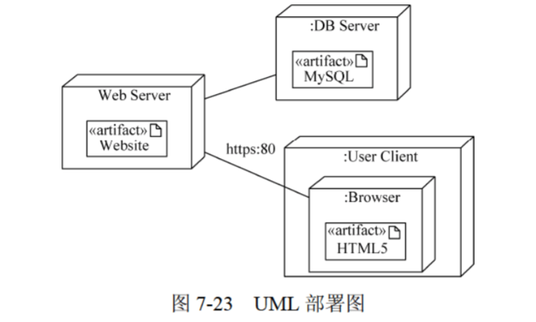

### 包图
不能执行，展现由模型本身分解而成的组织单元以及其间的依赖关系 
包可以拥有其他元素，可以是类、接口、构件、结点、协作、用例和图，甚至是嵌套的其他包 
一个元素只能被一个包所拥有

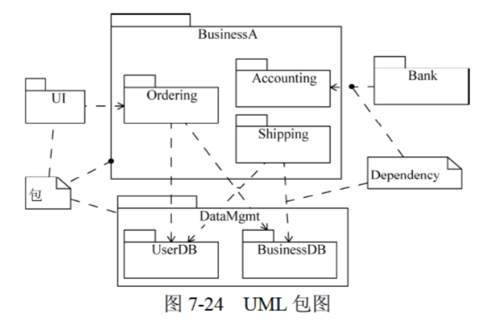

