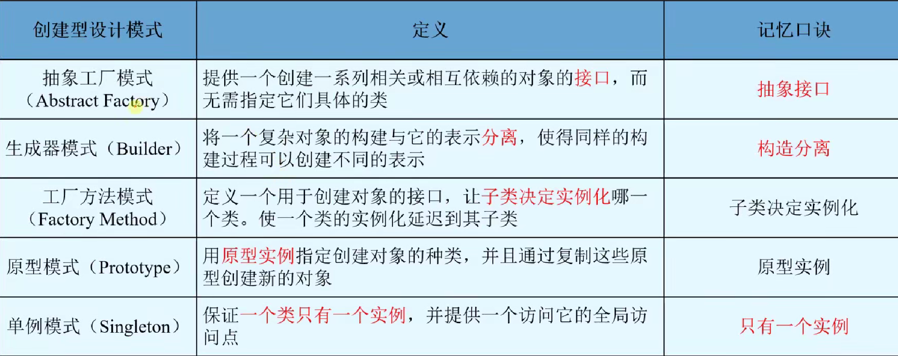

模式：对特定问题的解决方案 
设计模式的核心在于提供了相关问题的解决方案，便于复用成功的设计（开发经验）

设计模式的4个基本要素：
模式名称、问题、解决方案、效果

设计模式分为23类：

创建型模式与*对象的创建**有关；结构型模式处理*类或对象的组合*；行为型模式描述*类或对象怎样交互或怎样分配对象*

## 1. 创建型设计模式
所谓创建，是指**创建对象**

特点： 
**将对象的创建和使用分离**，使用对象时无需知道创建对象的细节（抽象了实例化过程，即创建对象的过程） 
使设计更符合单一职责原则，降低系统耦合性

### 1.1 抽象工厂模式
定义： 
提供一个**接口**，这个接口能创建一系列相关或相互依赖的对象，无需指定他们具体的类

分类：创建型对象模式

使用场景： 
