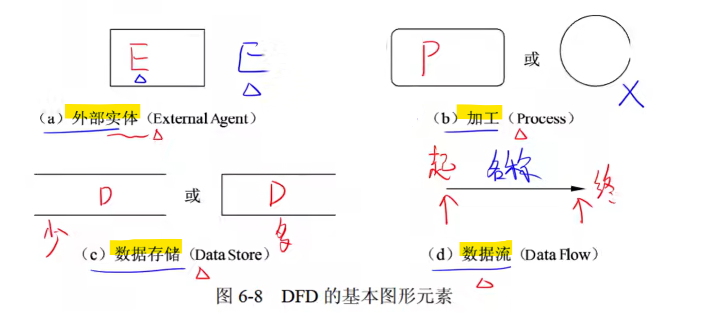
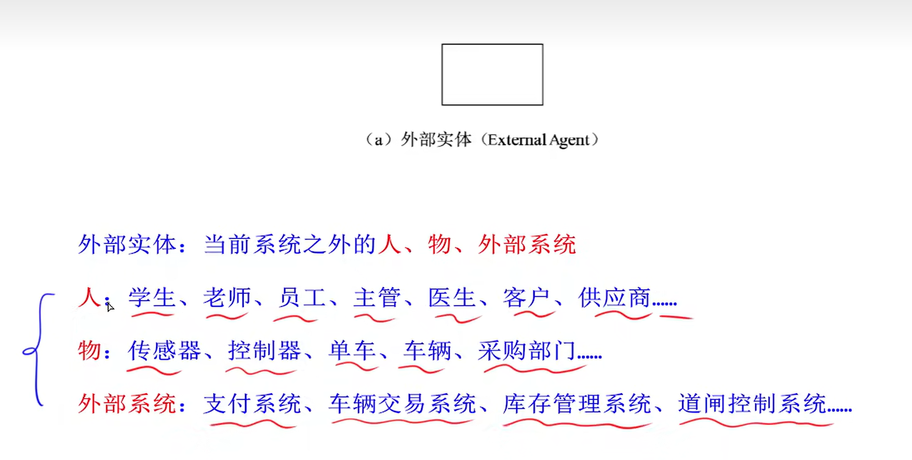
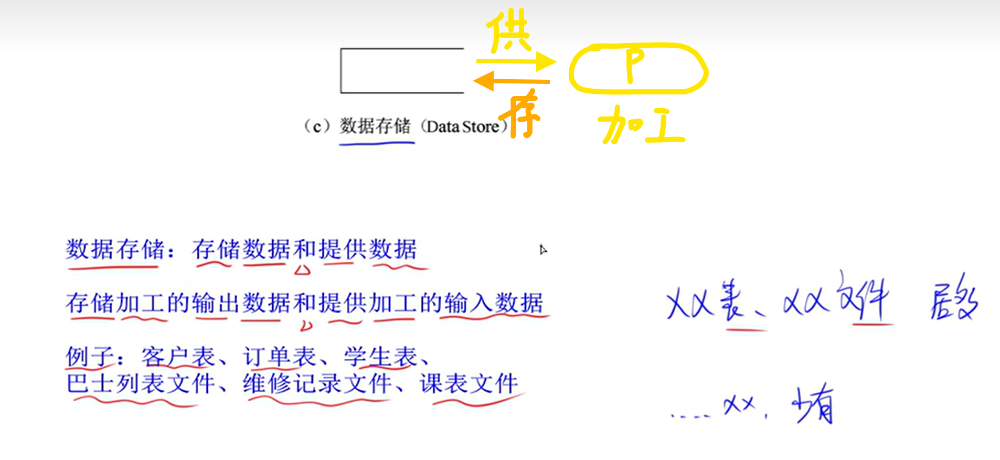
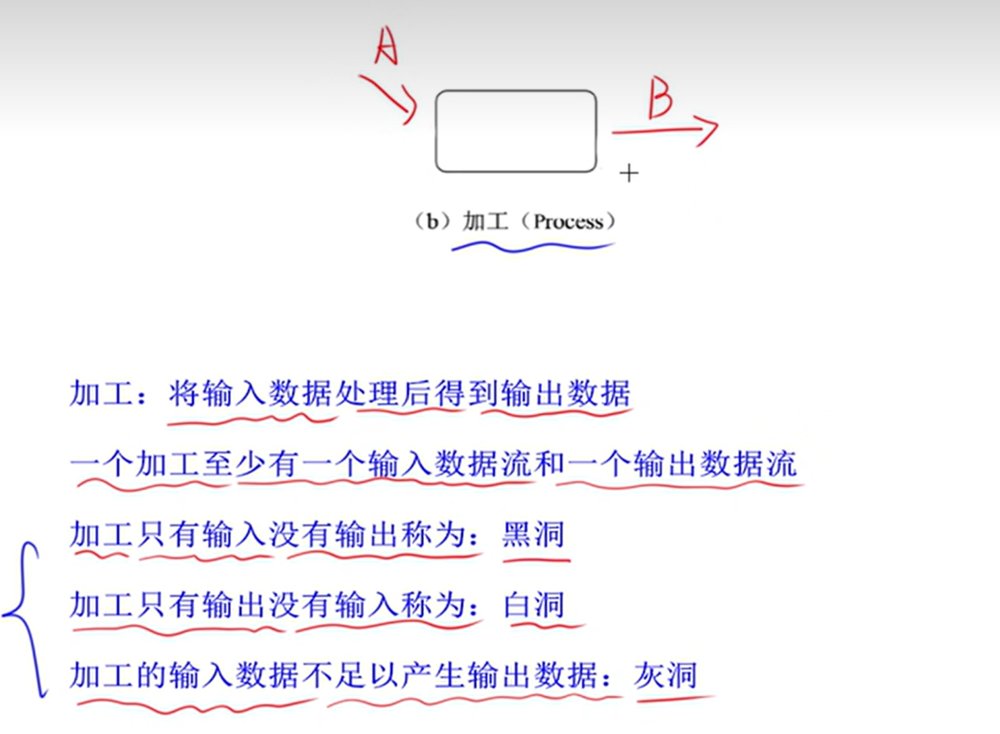
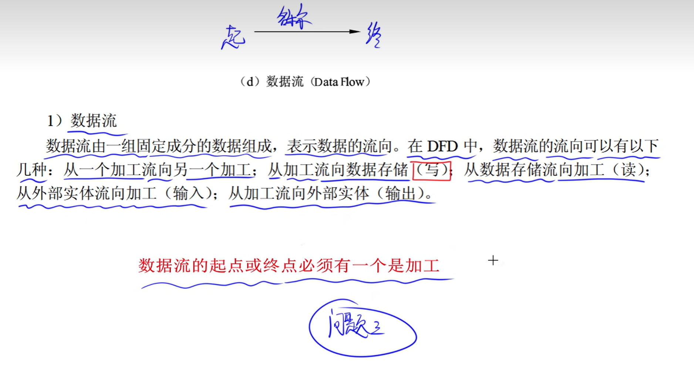

## 题型与分值
15分，4问 
(1)外部实体E 
(2)数据存储D 
(3)缺失数据流 
(4)拓展题 

至少拿10分，前三问

## 基本概念

## 做题技巧
其实就是阅读理解！

### (1)外部实体分别是什么
很好找，”说明“一般会写某个系统具有如下几条功能，这些功能就对应着子图的几个加工，用这个定位 
然后就是阅读理解，找说明中的实体就行

### (2)数据存储分别是什么
这个也很好找，也是根据每个功能对应子图加工进行定位 
然后在说明中找类似于”文件“”表“的词，就是数据存储 
如果没有，那就是数据流上标的数据加上”表"或“文件" 

### (3)确实数据流怎么找?几步走
+ 父图子图的平衡：父图中有的数据流，子图中也要有 
一般是子图确实数据流，所以先看父图，每一条读作“系统到E1”或“E1到系统”，然后去子图里找E1就行，主要看方向是指向外还是指向内

+ 加工既有输入数据流也有输出数据流（至少各一条） 
这个在加工中已经说明了

根据上面的方法定位缺失数据流后，再看”说明“确定数据流的具体细节

❗一定有一端是加工
