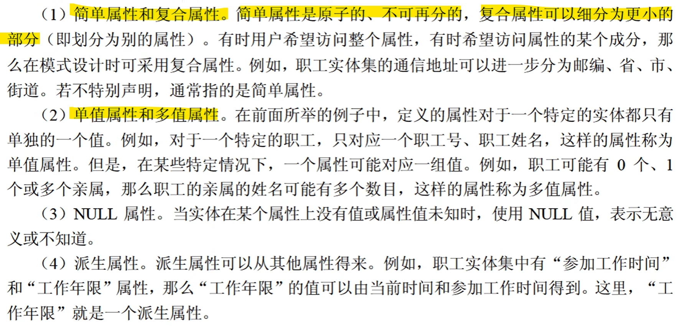

15分，3问

考的是数据库设计，包含几大部分： 
+ 说明 
+ 需求分析 
+ 概念模型（**ER图**） 
+ 逻辑结构（**关系模式**） 

至少拿10分，前两问

## 考点
ER图：

(1)实体 
+ 弱实体：

+ 子实体：（继承关系）

(2)属性

(3)联系

检验方法：1个A对x个B，1个B对y个A

关系模式：

ER图到关系模式的转换：

一对一：

总的来说，有两种方法，独立关系模式或者合并到一方实体

一对多也是类似的两种方式，为了以表区分，有时会把一对一的外键标上UNIQUE（外键唯一）

多对多：

超类和子实体

## 题目
问题1：补全ER图中缺失的联系 
问题2：补全关系模式，给出主键外键

